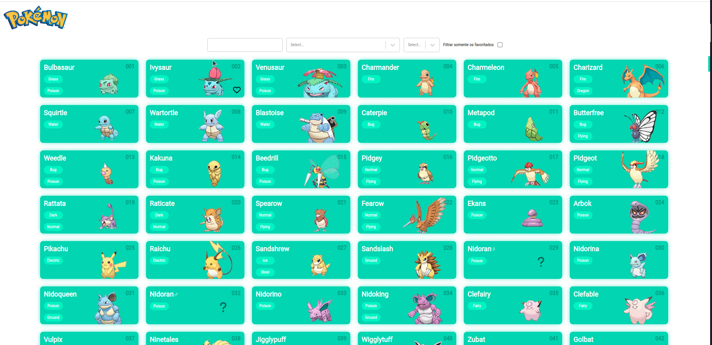

# Pokedex

## Libraries uitlizadas

Para dar o start no projeto basta executar yarn start

## Libraries uitlizadas

- react react-dom
- react-hook-form
- react-select
- styled-component
- lodash
- typescript

## Tests

Para executar os testes unitários basta executar o comando yarn test